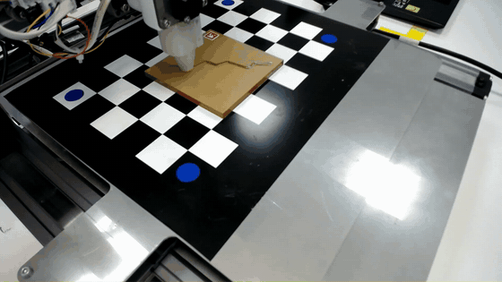
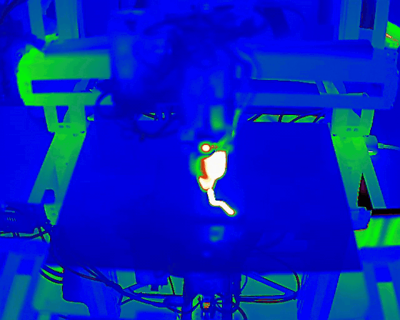
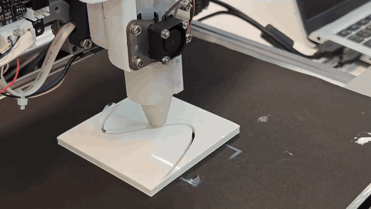
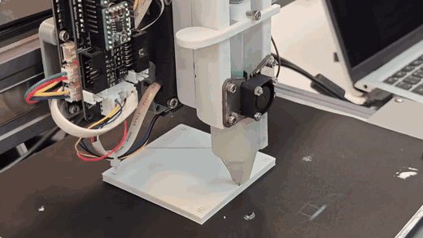
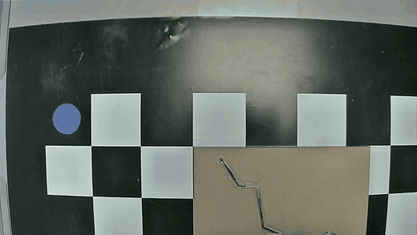

# Thermally Activated Hot-Melt Deposition within FDM Structures

A media showcase of a perception-guided hot-melt deposition system that places molten polymer into cracks, grooves and cavities of existing 3D-printed parts.

Department of Mechanical Engineering, Faculty of Engineering, Chulalongkorn University, Bangkok, Thailand.

---

## Experimental Photographs

### Hot-melt bead patterns

| | | |
|:---:|:---:|:---:|
|  |  |  |
| Serpentine bead of hot-melt polymer on a gold-coloured surface. | Serpentine bead on a pale surface, close-up. | Serpentine bead photographed beside a ruler for scale. |

### Crack and groove filling

| | |
|:---:|:---:|
|  |  |
| Transparent hot-melt polymer along a zig-zag crack. | Polymer following a long, curved groove. |
|  |  |
| Polymer filling an S-shaped groove. | Polymer filling a V-shaped groove. |

### Luminescent material

| | |
|:---:|:---:|
|  |  |
| Luminescent polymer insert glowing green in low light. | The same type of part from an oblique angle. |

---

## Video Demonstrations

Click a preview to watch the full video on YouTube.

<table>
  <tr>
    <td width="50%" align="center" valign="top"></td>
    <td width="50%" align="center" valign="top"></td>
  </tr>
  <tr>
    <td width="50%" align="center" valign="top"><strong>Deposition run</strong> — a workpiece on the machine bed, with the planned path projected before the polymer is deposited.</td>
    <td width="50%" align="center" valign="top"><strong>Thermal recording</strong> — infrared view of the platform while the polymer is deposited and cools.</td>
  </tr>
  <tr>
    <td width="50%" align="center" valign="top"><a href="https://youtu.be/0s1RABJZrxQ">▶ Watch on YouTube</a> · <a href="https://github.com/Akarapon1909/Thermally-Activated-Hot-Melt-Deposition-within-FDM-Structures/raw/main/assets/videos/hot-melt-injection-front-view.mp4">⬇ Download MP4</a></td>
    <td width="50%" align="center" valign="top"><a href="https://youtu.be/N7qd_YeSdYk">▶ Watch on YouTube</a> · <a href="https://github.com/Akarapon1909/Thermally-Activated-Hot-Melt-Deposition-within-FDM-Structures/raw/main/assets/videos/thermal-camera-recording.mp4">⬇ Download MP4</a></td>
  </tr>
  <tr>
    <td width="50%" align="center" valign="top"></td>
    <td width="50%" align="center" valign="top"></td>
  </tr>
  <tr>
    <td width="50%" align="center" valign="top"><strong>S-curve groove, close-up</strong> — the nozzle depositing polymer into an S-shaped groove on a white plate.</td>
    <td width="50%" align="center" valign="top"><strong>Zig-zag crack, close-up</strong> — the nozzle depositing polymer along a zig-zag crack.</td>
  </tr>
  <tr>
    <td width="50%" align="center" valign="top"><a href="https://youtu.be/SzJhBc62TtM">▶ Watch on YouTube</a> · <a href="https://github.com/Akarapon1909/Thermally-Activated-Hot-Melt-Deposition-within-FDM-Structures/raw/main/assets/videos/groove-filling-s-curve-closeup.mp4">⬇ Download MP4</a></td>
    <td width="50%" align="center" valign="top"><a href="https://youtu.be/SiIRgWF3_LQ">▶ Watch on YouTube</a> · <a href="https://github.com/Akarapon1909/Thermally-Activated-Hot-Melt-Deposition-within-FDM-Structures/raw/main/assets/videos/crack-filling-zigzag-closeup.mp4">⬇ Download MP4</a></td>
  </tr>
</table>

   
  <strong>Camera-based top view</strong> — overhead camera recording of the workpiece on the machine bed, with the deposited polymer line visible as the bed moves. The preview shows one of the two camera views. 
  <a href="https://youtu.be/vM9XD7gDWcU">▶ Watch on YouTube</a>

---

## License

Released under the [MIT License](LICENSE).
