# Thermally Activated Hot-Melt Deposition within FDM Structures

A media showcase of a perception-guided hot-melt deposition system that places molten polymer into cracks, grooves and cavities of existing 3D-printed parts.

Department of Mechanical Engineering, Faculty of Engineering, Chulalongkorn University, Bangkok, Thailand.

---

## Experimental Photographs

### Hot-melt bead patterns

| | | |
|:---:|:---:|:---:|
| 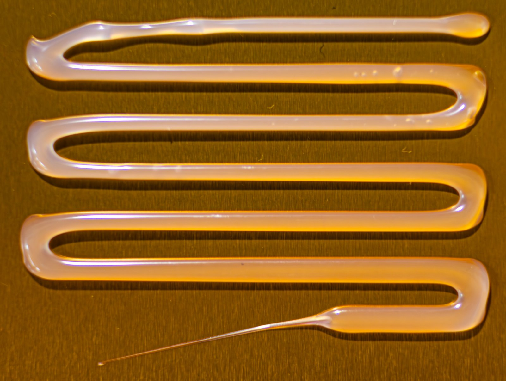 | 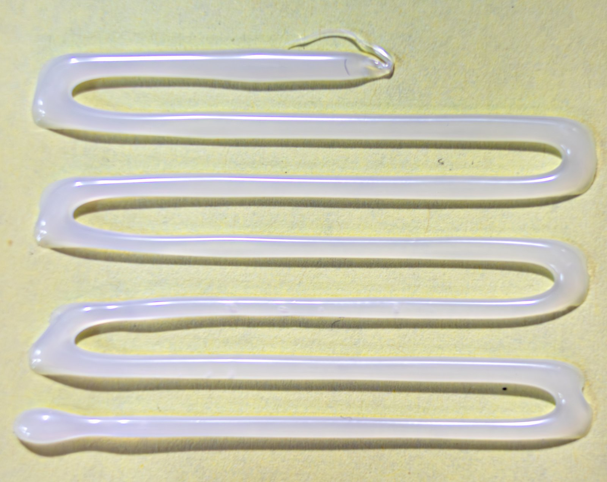 | 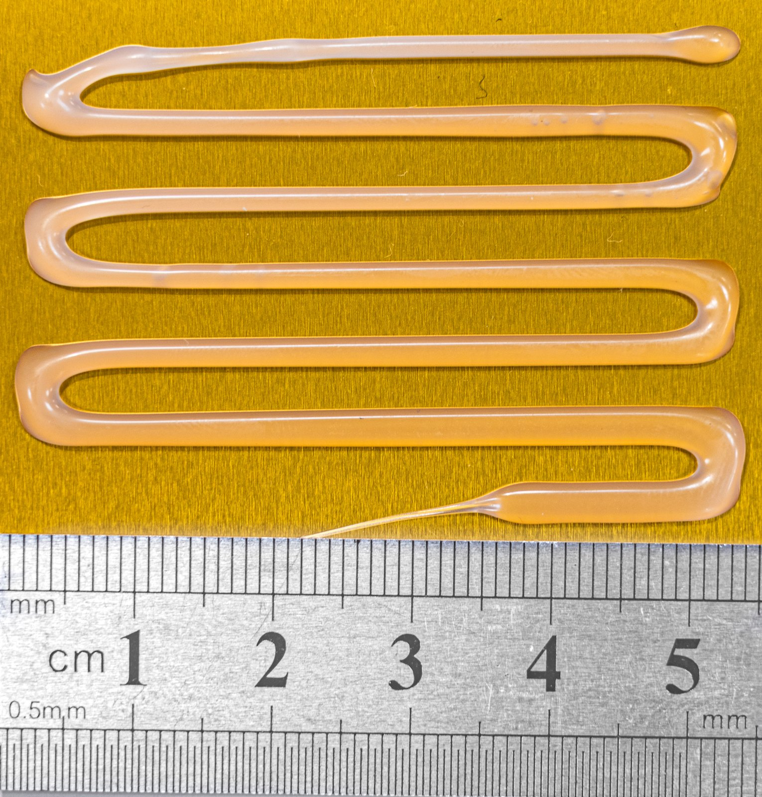 |
| Serpentine bead of hot-melt polymer on a gold-coloured surface. | Serpentine bead on a pale surface, close-up. | Serpentine bead photographed beside a ruler for scale. |

### Crack and groove filling

| | |
|:---:|:---:|
| 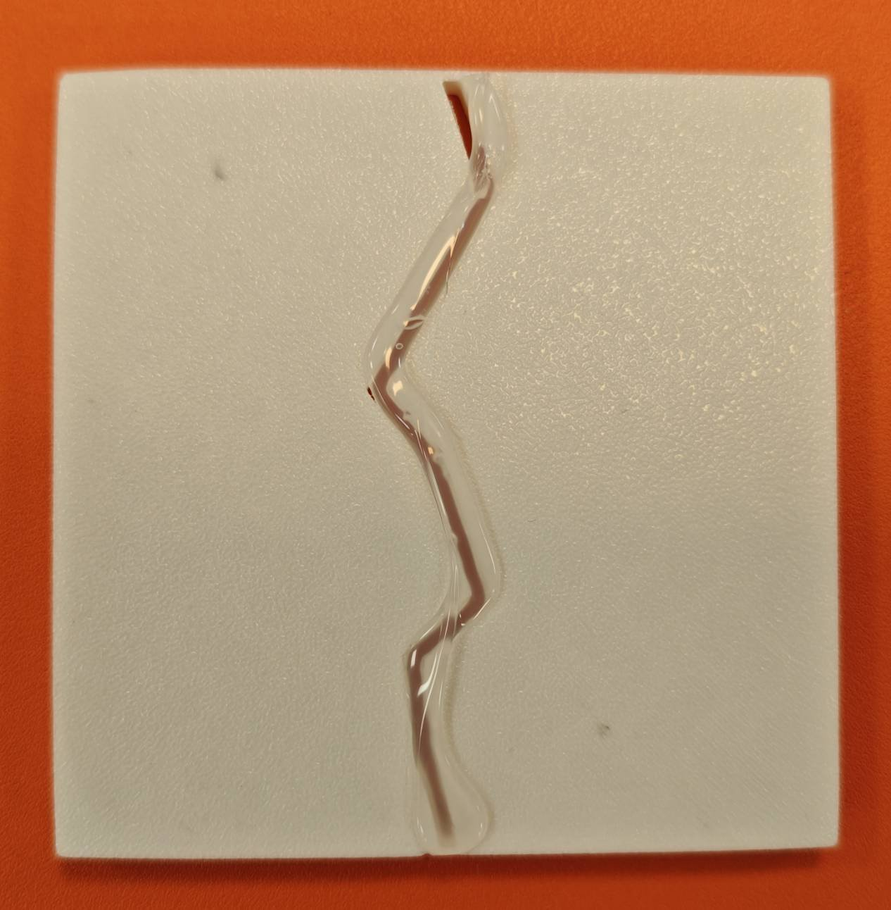 | 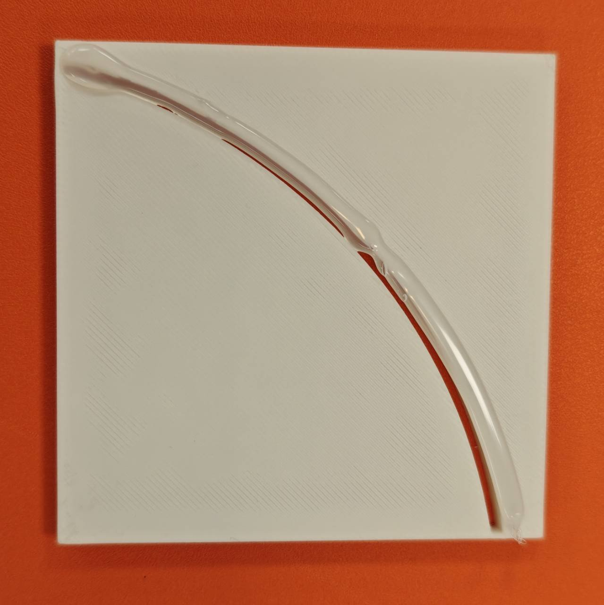 |
| Transparent hot-melt polymer along a zig-zag crack. | Polymer following a long, curved groove. |
| 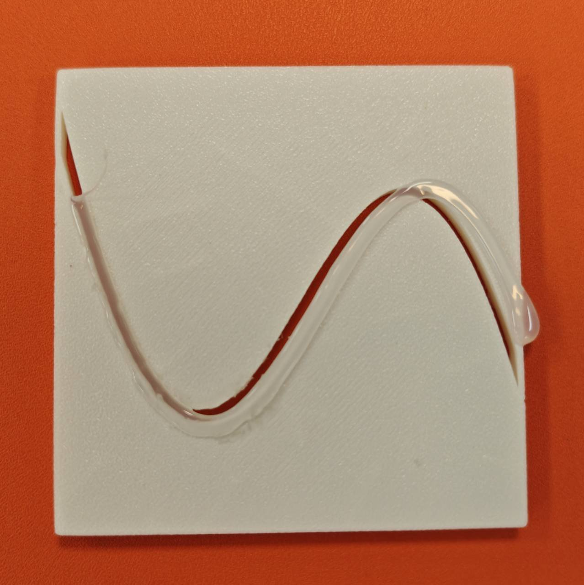 | 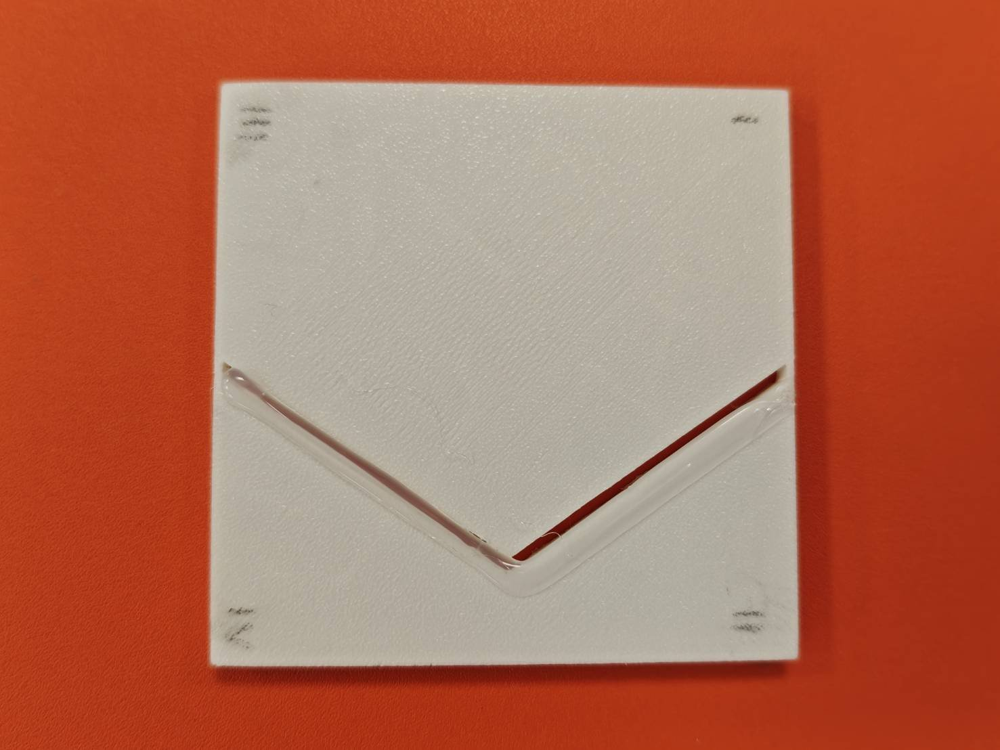 |
| Polymer filling an S-shaped groove. | Polymer filling a V-shaped groove. |

### Luminescent material

| | |
|:---:|:---:|
| 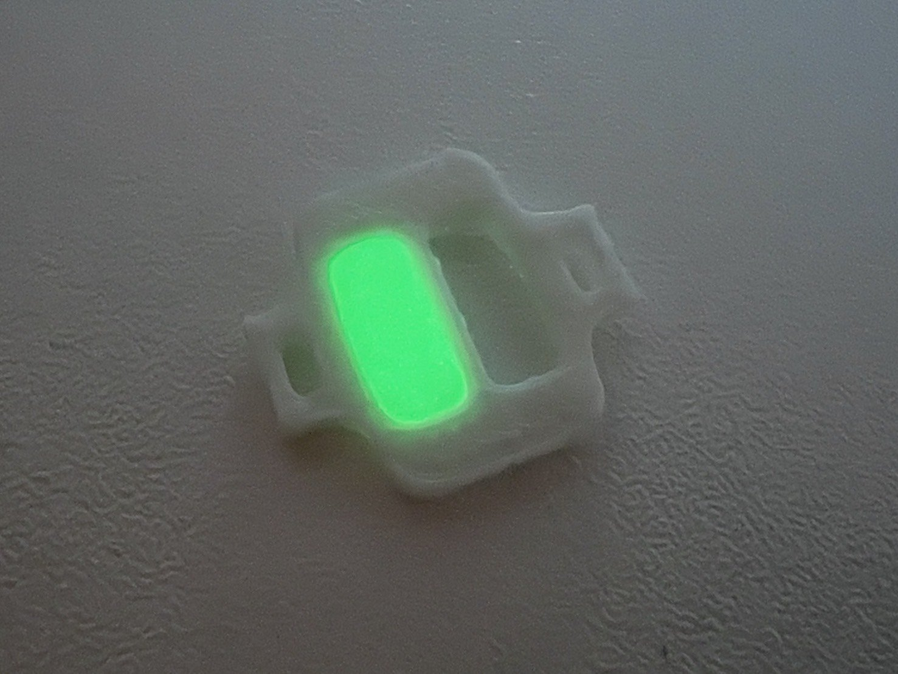 | 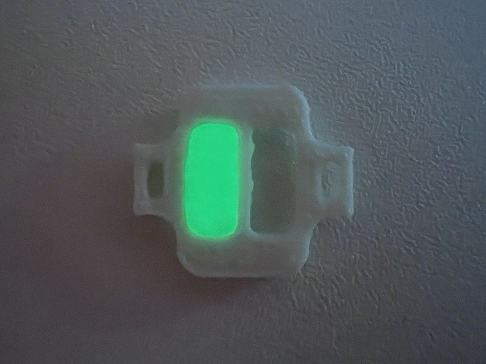 |
| Luminescent polymer insert glowing green in low light. | The same type of part from an oblique angle. |

---

## Video Demonstrations

Click a preview to open the video player.

| | |
|:---:|:---:|
| [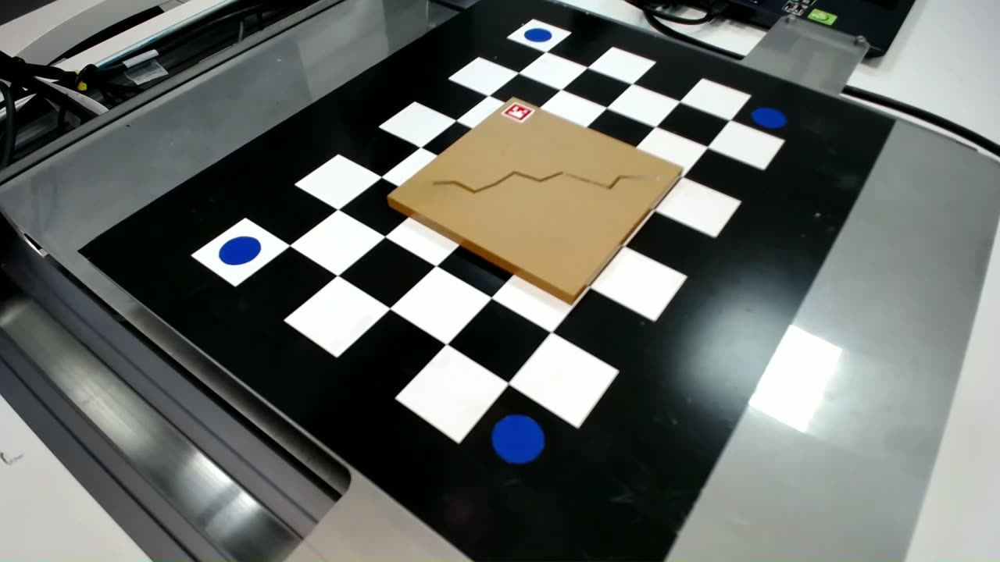](assets/videos/hot-melt-injection-front-view.mp4) | [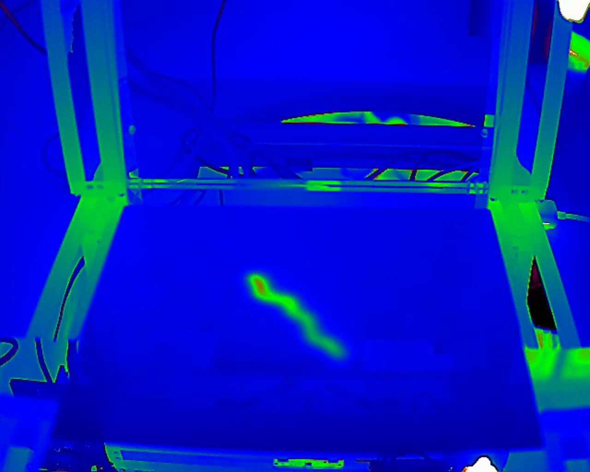](assets/videos/thermal-camera-recording.mp4) |
| **Deposition run** — a workpiece on the machine bed, with the planned path projected before the polymer is deposited. | **Thermal recording** — infrared view of the platform while the polymer is deposited and cools. |
| [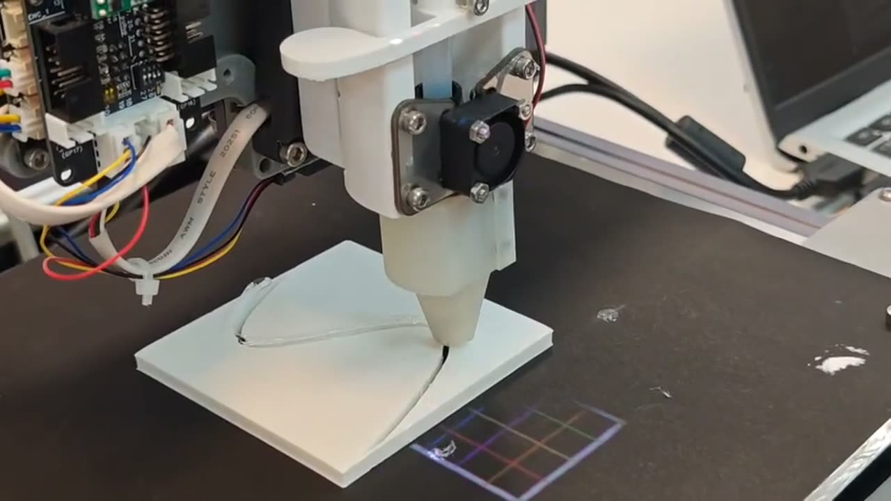](assets/videos/groove-filling-s-curve-closeup.mp4) | [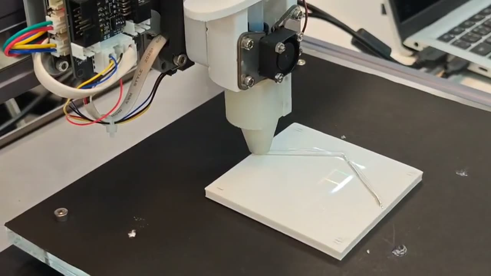](assets/videos/crack-filling-zigzag-closeup.mp4) |
| **S-curve groove, close-up** — the nozzle depositing polymer into an S-shaped groove on a white plate. | **Zig-zag crack, close-up** — the nozzle depositing polymer along a zig-zag crack. |

---

## License

Released under the [MIT License](LICENSE).
